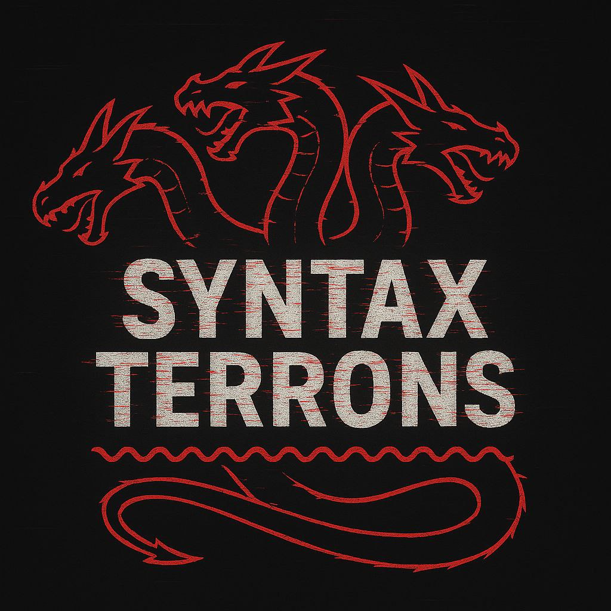
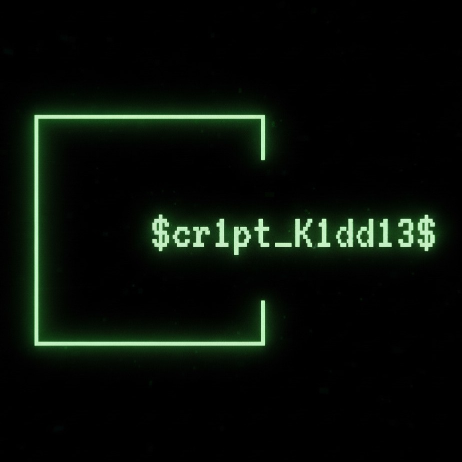

  🌐 Language: 
  <a href="README.it.md">🇮🇹 Italiano</a> | 
  <a href="README.md">🇬🇧 English</a>

# 🚩 CTF Writeups - GreyHat's pwn writeups.

> - Here I collect everything I mess with during **CTFs**, both team and solo: writeups, exploits, ponies.  
> - I focus on pwn and reversing, so if you’re here, you already know what you’ll find.  
> - Abandon all hope, ye who enter here.  
> - If you have any issues with the repo or its functions, [contact me](https://youtu.be/xvFZjo5PgG0?si=fHpPpKrQBXCy53fA)

## Teams

<table>
  <tr>
    <td align="center" width="50%" style="vertical-align: middle;">
       
      

        founding member of   <b>SyntaxTerrons</b>
      

    </td>
    <td align="center" width="50%" style="vertical-align: middle;">
       
      

         member of   <a href="https://scr1ptk1dd13s.xyz/" target="_blank" rel="noopener noreferrer"><strong>$cr1pt_K1dd13$</strong></a>
      

    </td>
  </tr>
</table>

## 📂 How is the repo organized?

- Each CTF has its own folder.  
- Inside, you’ll find subfolders with the challenge name.  
- If there are different categories, you’ll find them under a category folder.  
- Sometimes you’ll see clean scripts, sometimes code written at 3 a.m.  
- Some code is still stained with coffee.  
- Run the scripts with your eyes closed. That way, failure and success coexist.

---

## 🔧 🧰 Tools I use

- **[Sublime Text 3](https://www.sublimetext.com/3)**: editor for scripts.  
- **[radare2](https://www.radare.org/r/)**: debugger for dynamic analysis.  
- **[Ghidra](https://ghidra-sre.org/)**: decompiler for static analysis.  
- **[Python 3](https://www.python.org/)**: programming language for scripting.  
- **[pwntools](https://docs.pwntools.com/en/stable/)**: Python library and toolkit for pwn and reversing.  
- **[pwninit](https://github.com/io12/pwninit)**: util with patchelf to fix binary linking and generate pwntools templates.  
- Insomnia.  
- Water.  

In the root you’ll find the **tools** folder, which contains the pwninit template I use.

---

## 🎯 Why do I do it?

- I get bored.  
- I save solutions before the computer explodes.  
- I pass on knowledge to poor souls walking the same path, so they can suffer a little less.  
- Or scare them enough to save them from this binary suffering.  

---

## ⚠️ Disclaimer

Everything here is for **educational and fun purposes only**.  
Don’t be a smartass.  

---

## 🤝 Want to contribute?

- Fork the repo  
- Add your writeup or improve the existing ones (like fixing spelling horrors)  
- Send a Pull Request  
- Embark on a journey of self-discovery  
- While you’re traveling, I might notice and accept it  

---

## 📫 Contact me

No.
